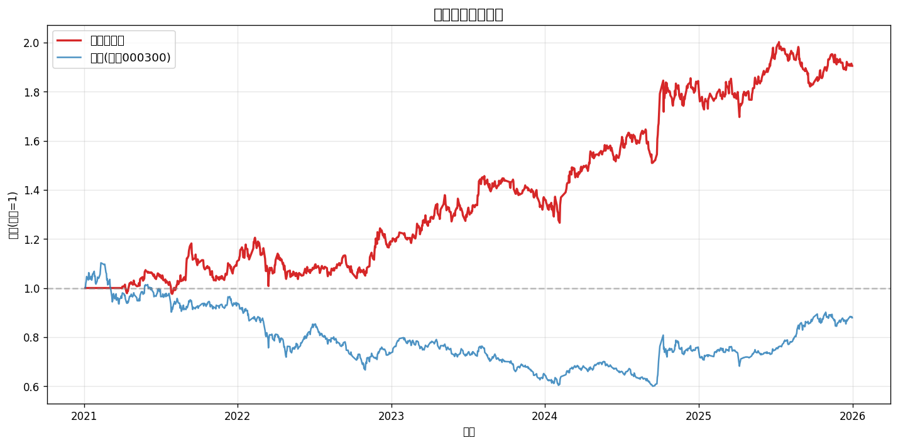
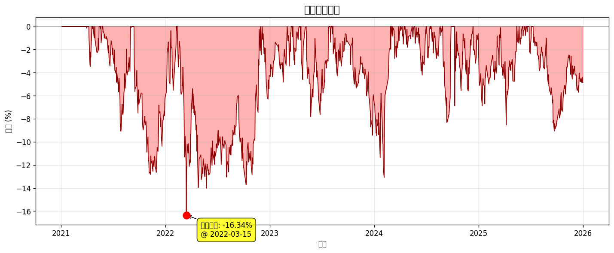
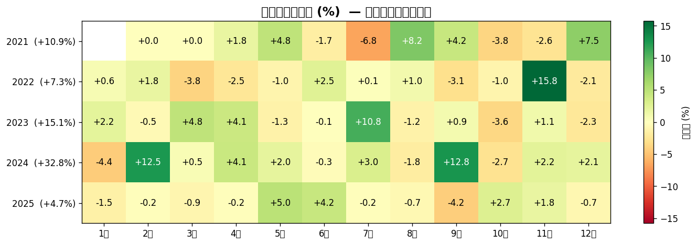
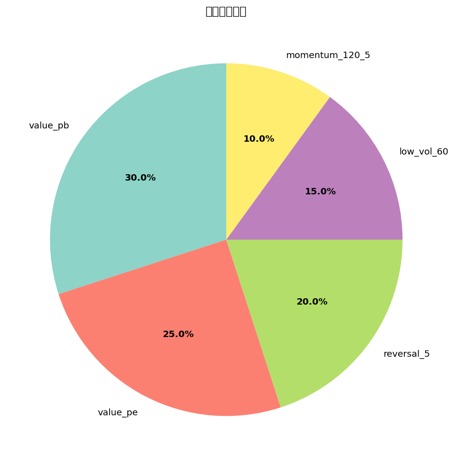

# 多因子选股策略回测报告

**生成时间**: 2026-05-11 11:07:11  
**回测区间**: 2021-01-04 ~ 2025-12-31  
**股票池**: HS300  
**调仓频率**: ME (月调)  
**持仓数量**: Top 30  
**标准化方式**: rank  

---

## 一、核心指标

| 指标 | 数值 |
|------|------|
| 总收益率 | **90.54%** |
| 年化收益率 | **14.36%** |
| 年化波动率 | **17.49%** |
| 夏普比率 | **0.71** |
| 最大回撤 | **-16.34%** |
| 卡玛比率 | **0.88** |
| 日胜率 | **48.9%** |
| 回测天数 | **1211 (4.8年)** |
| 基准总收益 | **-12.11%** |
| 基准年化 | **-2.65%** |
| 年化超额 | **17.01%** |
| 信息比率 | **1.08** |

---

## 二、净值曲线

## 三、回撤曲线

## 四、月度收益热力图

## 五、因子权重

---

## 六、年度收益对比

| 年份 | 策略 | 基准(沪深300) | 超额 |
|------|------|------|------|
| 2021 | +10.94% | -6.21% | 🟢 +17.15% |
| 2022 | +7.32% | -21.63% | 🟢 +28.95% |
| 2023 | +15.09% | -11.38% | 🟢 +26.47% |
| 2024 | +32.75% | +14.68% | 🟢 +18.07% |
| 2025 | +4.75% | +17.66% | 🔴 -12.92% |

---

## 七、最新一期持仓 (2025-12-31)

等权配置, 共 **33** 只, 单只权重 **3.03%**

| 排名 | 代码 | 名称 | 综合得分 |
|------|------|------|---------|
| 1 | 001391 | 国货航 | 0.7892 |
| 2 | 603296 | 华勤技术 | 0.7089 |
| 3 | 688472 | 阿特斯 | 0.7009 |
| 4 | 600938 | 中国海油 | 0.6991 |
| 5 | 601059 | 信达证券 | 0.6373 |
| 6 | 601136 | 首创证券 | 0.5594 |
| 7 | 688082 | 盛美上海 | 0.5121 |
| 8 | 688271 | 联影医疗 | 0.4431 |
| 9 | 688223 | 晶科能源 | 0.3966 |
| 10 | 688506 | 百利天恒 | 0.3580 |
| 11 | 600690 | 青岛海尔 | 0.3500 |
| 12 | 601186 | 中国铁建 | 0.3345 |
| 13 | 000858 | 五粮液 | 0.3345 |
| 13 | 000858 | 五粮液 | 0.3345 |
| 14 | 600023 | 浙能电力 | 0.3341 |
| 15 | 600011 | 华能国际 | 0.3334 |
| 16 | 600018 | 上港集团 | 0.3319 |
| 17 | 600027 | 华电国际 | 0.3294 |
| 17 | 600027 | 华电国际 | 0.3294 |
| 18 | 300628 | 亿联网络 | 0.3285 |
| 19 | 600585 | 海螺水泥 | 0.3282 |
| 20 | 600519 | 贵州茅台 | 0.3224 |
| 21 | 600918 | 中泰证券 | 0.3202 |
| 21 | 600918 | 中泰证券 | 0.3202 |
| 22 | 601006 | 大秦铁路 | 0.3168 |
| 23 | 601728 | 中国电信 | 0.3168 |
| 24 | 600233 | 圆通速递 | 0.3161 |
| 25 | 600674 | 川投能源 | 0.3161 |
| 26 | 002252 | 上海莱士 | 0.3157 |
| 27 | 603195 | 公牛集团 | 0.3155 |
| 28 | 000895 | 双汇发展 | 0.3141 |
| 29 | 002371 | 北方华创 | 0.3132 |
| 30 | 600009 | 上海机场 | 0.3117 |

---

## 八、报告说明

### 关键指标含义
- **年化收益率**: 假设按当前复利持续 1 年的收益
- **夏普比率**: 单位风险换取的超额收益, > 1 优秀, > 0.5 合格
- **最大回撤**: 净值从峰值到谷底的最大跌幅, 衡量极端风险
- **信息比率**: 跑赢基准的稳定性, > 0.5 不错, > 1 优秀
- **卡玛比率**: 年化收益 / 最大回撤, 衡量收益质量

### 回测假设
- 单边交易成本: 0.15% (含印花税/佣金/滑点)
- 调仓日选股, **次日**收盘价进场 (避免未来函数)
- 等权配置, 月内不再平衡
- 不考虑停牌、涨跌停限制

### 局限性
- 仅使用量价因子, 无基本面信息
- 沪深300成分股使用当前名单, 存在轻微幸存者偏差
- 历史业绩不代表未来表现