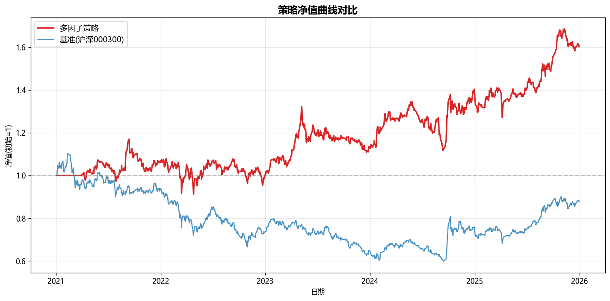
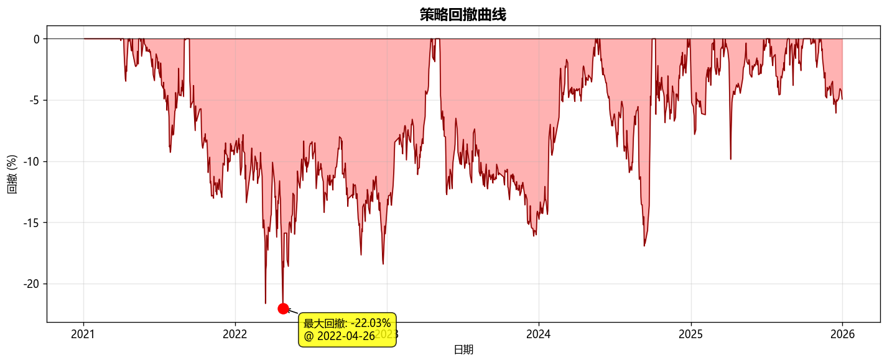
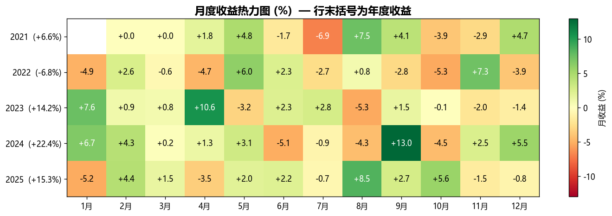
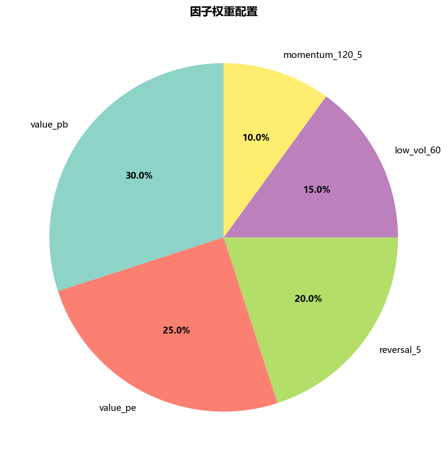

# 多因子选股策略回测报告

**生成时间**: 2026-05-11 16:02:39  
**回测区间**: 2021-01-04 ~ 2025-12-31  
**股票池**: HS300  
**调仓频率**: ME (月调)  
**持仓数量**: Top 30  
**标准化方式**: rank  

---

## 一、核心指标

| 指标 | 数值 |
|------|------|
| 总收益率 | **60.26%** |
| 年化收益率 | **10.31%** |
| 年化波动率 | **17.70%** |
| 夏普比率 | **0.47** |
| 最大回撤 | **-22.03%** |
| 卡玛比率 | **0.47** |
| 日胜率 | **48.1%** |
| 回测天数 | **1211 (4.8年)** |
| 基准总收益 | **-12.11%** |
| 基准年化 | **-2.65%** |
| 年化超额 | **12.96%** |
| 信息比率 | **0.86** |

---

## 二、净值曲线

## 三、回撤曲线

## 四、月度收益热力图

## 五、因子权重

---

## 六、年度收益对比

| 年份 | 策略 | 基准(沪深300) | 超额 |
|------|------|------|------|
| 2021 | +6.64% | -6.21% | 🟢 +12.86% |
| 2022 | -6.77% | -21.63% | 🟢 +14.86% |
| 2023 | +14.24% | -11.38% | 🟢 +25.62% |
| 2024 | +22.39% | +14.68% | 🟢 +7.70% |
| 2025 | +15.29% | +17.66% | 🔴 -2.37% |

---

## 七、最新一期持仓 (2025-12-31)

等权配置, 共 **33** 只, 单只权重 **3.03%**

| 排名 | 代码 | 名称 | 综合得分 |
|------|------|------|---------|
| 1 | 601186 | 中国铁建 | 0.8777 |
| 2 | 601800 | 中国交建 | 0.8243 |
| 3 | 000001 | 深发展A | 0.8210 |
| 3 | 000001 | 深发展A | 0.8210 |
| 4 | 601668 | 中国建筑 | 0.8186 |
| 5 | 600023 | 浙能电力 | 0.8098 |
| 6 | 600018 | 上港集团 | 0.8058 |
| 7 | 601669 | 中国水电 | 0.8046 |
| 8 | 600585 | 海螺水泥 | 0.7991 |
| 9 | 002142 | 宁波银行 | 0.7951 |
| 10 | 600027 | 华电国际 | 0.7879 |
| 10 | 600027 | 华电国际 | 0.7879 |
| 11 | 601838 | 成都银行 | 0.7806 |
| 12 | 601169 | 北京银行 | 0.7804 |
| 13 | 601390 | 中国中铁 | 0.7770 |
| 14 | 601919 | 中国远洋 | 0.7739 |
| 15 | 601006 | 大秦铁路 | 0.7640 |
| 16 | 600015 | 华夏银行 | 0.7637 |
| 17 | 601898 | 中煤能源 | 0.7632 |
| 18 | 601868 | 中国能建 | 0.7580 |
| 19 | 601818 | 光大银行 | 0.7549 |
| 20 | 601916 | 浙商银行 | 0.7488 |
| 21 | 601607 | 上海医药 | 0.7475 |
| 22 | 600016 | 民生银行 | 0.7456 |
| 23 | 601398 | 工商银行 | 0.7421 |
| 24 | 601166 | 兴业银行 | 0.7392 |
| 25 | 600011 | 华能国际 | 0.7382 |
| 26 | 601298 | 青岛港 | 0.7322 |
| 27 | 600926 | 杭州银行 | 0.7303 |
| 28 | 000651 | 格力电器 | 0.7246 |
| 28 | 000651 | 格力电器 | 0.7246 |
| 29 | 601318 | 中国平安 | 0.7232 |
| 30 | 600690 | 青岛海尔 | 0.7211 |

---

## 八、报告说明

### 关键指标含义
- **年化收益率**: 假设按当前复利持续 1 年的收益
- **夏普比率**: 单位风险换取的超额收益, > 1 优秀, > 0.5 合格
- **最大回撤**: 净值从峰值到谷底的最大跌幅, 衡量极端风险
- **信息比率**: 跑赢基准的稳定性, > 0.5 不错, > 1 优秀
- **卡玛比率**: 年化收益 / 最大回撤, 衡量收益质量

### 回测假设
- 单边交易成本: 0.15% (含印花税/佣金/滑点)
- 调仓日选股, **次日**收盘价进场 (避免未来函数)
- 等权配置, 月内不再平衡
- 不考虑停牌、涨跌停限制

### 局限性
- 仅使用量价因子, 无基本面信息
- 沪深300成分股使用当前名单, 存在轻微幸存者偏差
- 历史业绩不代表未来表现