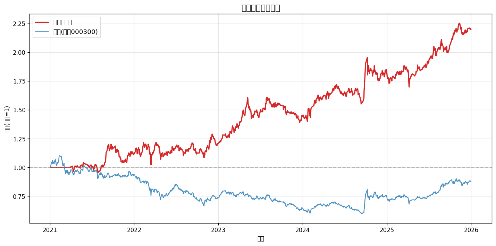
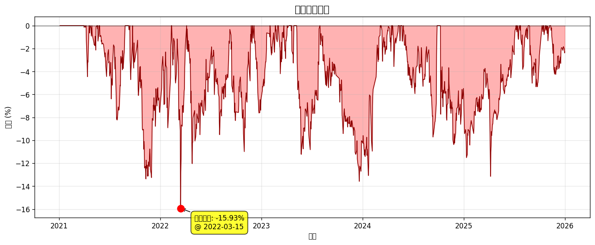
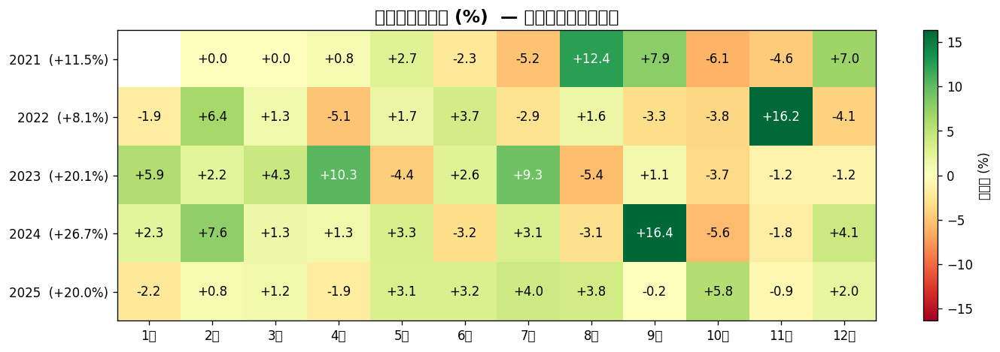

# 多因子选股策略回测报告

**生成时间**: 2026-06-01 20:37:26  
**回测区间**: 2021-01-04 ~ 2025-12-31  
**股票池**: HS300  
**调仓频率**: ME (月调)  
**持仓数量**: Top 30  
**标准化方式**: rank  

---

## 一、核心指标

| 指标 | 数值 |
|------|------|
| 总收益率 | **120.07%** |
| 年化收益率 | **17.84%** |
| 年化波动率 | **18.78%** |
| 夏普比率 | **0.84** |
| 最大回撤 | **-15.93%** |
| 卡玛比率 | **1.12** |
| 日胜率 | **49.9%** |
| 回测天数 | **1211 (4.8年)** |
| 基准总收益 | **-12.11%** |
| 基准年化 | **-2.65%** |
| 年化超额 | **20.49%** |
| 信息比率 | **1.34** |

---

## 二、净值曲线

## 三、回撤曲线

## 四、月度收益热力图

## 五、因子权重

---

## 六、年度收益对比

| 年份 | 策略 | 基准(沪深300) | 超额 |
|------|------|------|------|
| 2021 | +11.55% | -6.21% | 🟢 +17.76% |
| 2022 | +8.13% | -21.63% | 🟢 +29.77% |
| 2023 | +20.05% | -11.38% | 🟢 +31.43% |
| 2024 | +26.67% | +14.68% | 🟢 +11.98% |
| 2025 | +19.98% | +17.66% | 🟢 +2.32% |

---

## 七、最新一期持仓 (2025-12-31)

等权配置, 共 **30** 只, 单只权重 **3.33%**

| 排名 | 代码 | 名称 | 综合得分 |
|------|------|------|---------|
| 1 | 601186 | 中国铁建 | 0.8772 |
| 2 | 601800 | 中国交建 | 0.8257 |
| 3 | 000001 | 深发展A | 0.8214 |
| 4 | 601668 | 中国建筑 | 0.8188 |
| 5 | 600023 | 浙能电力 | 0.8108 |
| 6 | 600018 | 上港集团 | 0.8066 |
| 7 | 600585 | 海螺水泥 | 0.8020 |
| 8 | 002142 | 宁波银行 | 0.7970 |
| 9 | 600027 | 华电国际 | 0.7895 |
| 10 | 601169 | 北京银行 | 0.7805 |
| 11 | 601919 | 中国远洋 | 0.7752 |
| 12 | 601006 | 大秦铁路 | 0.7684 |
| 13 | 601898 | 中煤能源 | 0.7644 |
| 14 | 601607 | 上海医药 | 0.7493 |
| 15 | 600011 | 华能国际 | 0.7402 |
| 16 | 000002 | 万科A | 0.7386 |
| 17 | 000651 | 格力电器 | 0.7262 |
| 18 | 601318 | 中国平安 | 0.7241 |
| 19 | 600690 | 青岛海尔 | 0.7228 |
| 20 | 601211 | 国泰君安 | 0.7208 |
| 21 | 601728 | 中国电信 | 0.7142 |
| 22 | 601319 | 中国人保 | 0.7024 |
| 23 | 601336 | 新华保险 | 0.7017 |
| 24 | 600999 | 招商证券 | 0.6917 |
| 25 | 600050 | 中国联通 | 0.6916 |
| 26 | 000166 | 申万宏源 | 0.6862 |
| 27 | 001979 | 招商蛇口 | 0.6766 |
| 28 | 000338 | 潍柴动力 | 0.6738 |
| 29 | 601225 | 陕西煤业 | 0.6609 |
| 30 | 002252 | 上海莱士 | 0.6573 |

---

## 八、报告说明

### 关键指标含义
- **年化收益率**: 假设按当前复利持续 1 年的收益
- **夏普比率**: 单位风险换取的超额收益, > 1 优秀, > 0.5 合格
- **最大回撤**: 净值从峰值到谷底的最大跌幅, 衡量极端风险
- **信息比率**: 跑赢基准的稳定性, > 0.5 不错, > 1 优秀
- **卡玛比率**: 年化收益 / 最大回撤, 衡量收益质量

### 回测假设
- 单边交易成本: 0.15% (含印花税/佣金/滑点)
- 调仓日选股, **次日**收盘价进场 (避免未来函数)
- 等权配置, 月内不再平衡
- 不考虑停牌、涨跌停限制

### 局限性
- 仅使用量价因子, 无基本面信息
- 沪深300成分股使用当前名单, 存在轻微幸存者偏差
- 历史业绩不代表未来表现